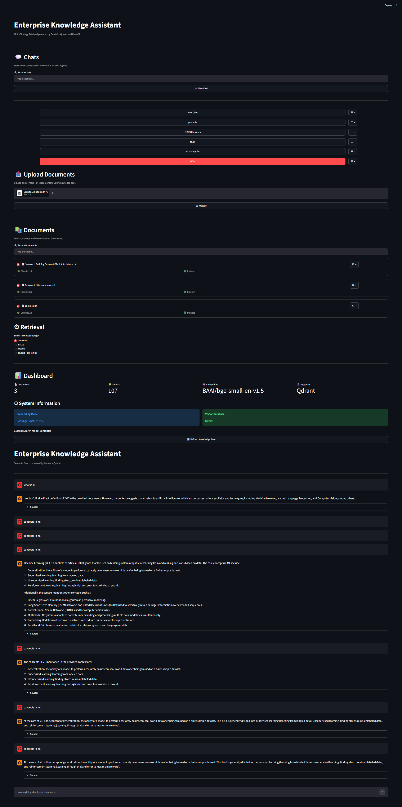
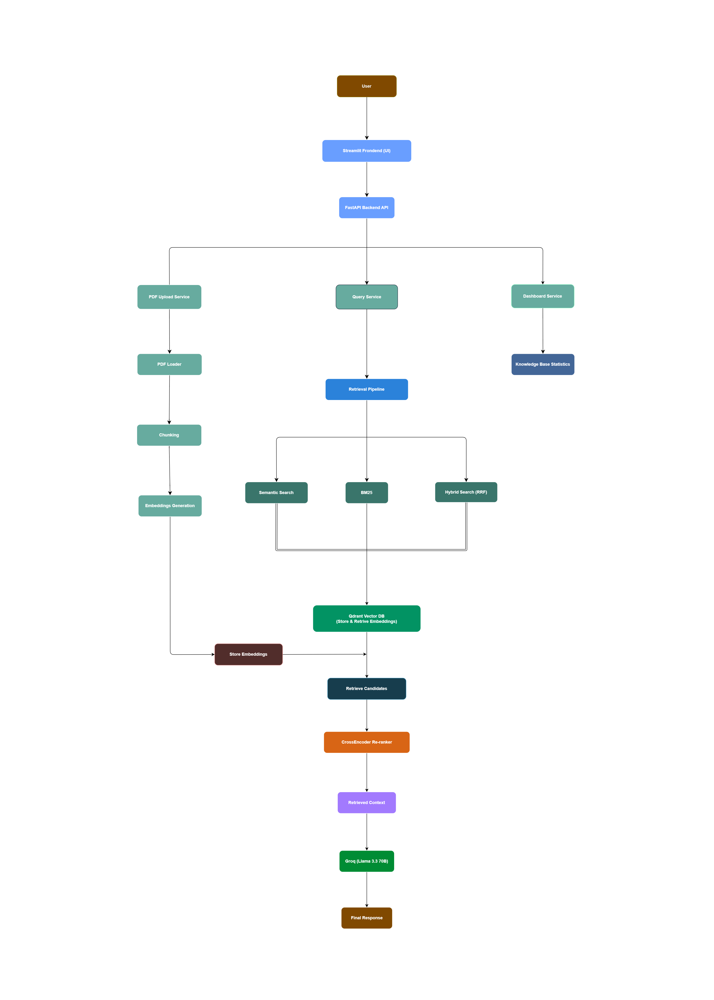
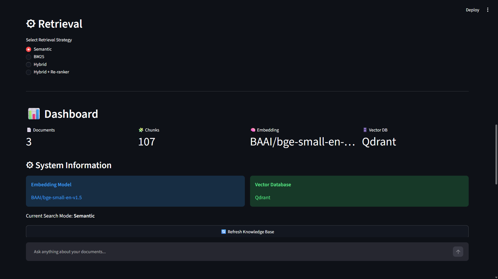
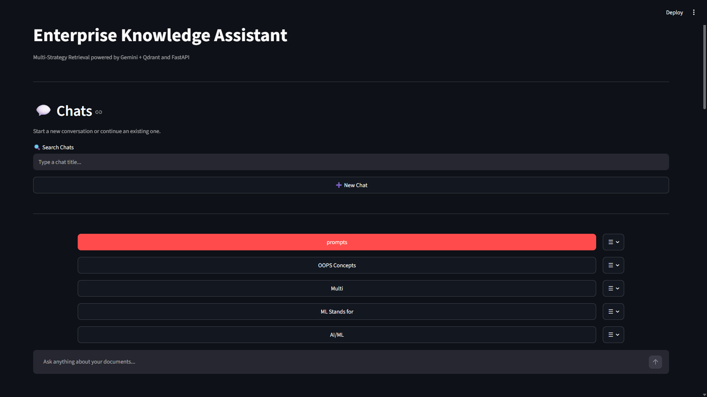
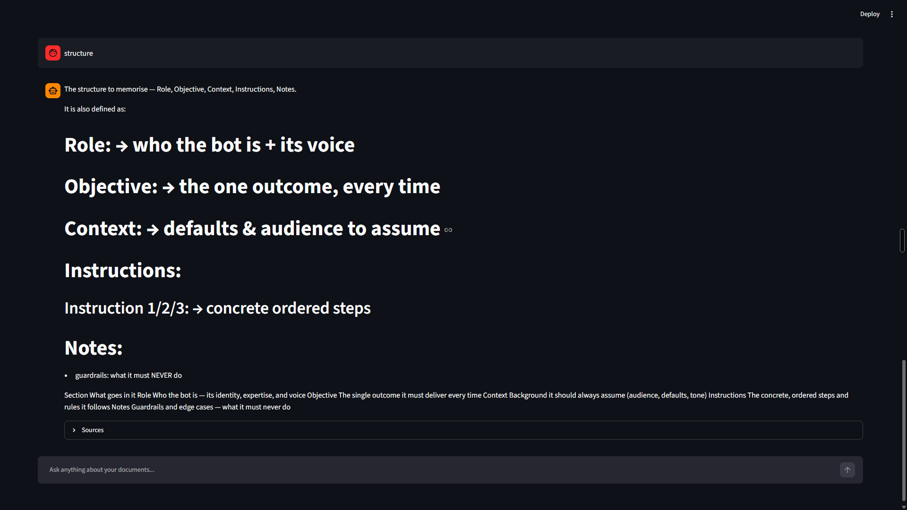

# 🚀 Enterprise Knowledge Assistant

<p align="center">

A <b>production-inspired Retrieval-Augmented Generation (RAG)</b> application built with <b>FastAPI</b>, <b>Streamlit</b>, <b>Qdrant</b>, <b>Hybrid Search</b>, <b>BM25</b>, and <b>CrossEncoder Re-ranking</b> for intelligent document question answering.

</p>

<p align="center">


</p>

---

## 🖥️ Application Preview

> **Replace with your best application screenshot**



---

## ⭐ Key Highlights

- ⚡ Hybrid Search (Semantic + BM25)
- 🎯 CrossEncoder Re-ranking
- 🧠 Qdrant Vector Database
- 📄 Intelligent PDF Knowledge Base
- 💬 Conversational Document QA
- 📊 Interactive Dashboard
- 🗂 Persistent Chat History
- 🏗 Modular FastAPI Architecture

---

## 📖 About the Project

Enterprise Knowledge Assistant is a production-inspired Retrieval-Augmented Generation (RAG) system that enables users to upload PDF documents, build a searchable knowledge base, and ask natural language questions over their content.

Unlike traditional chatbots that rely solely on a Large Language Model, this application retrieves relevant information from user-uploaded documents before generating responses. The retrieval pipeline combines dense vector search, BM25 keyword search, Reciprocal Rank Fusion (RRF), and CrossEncoder re-ranking to improve retrieval accuracy and produce grounded answers.

The project is designed with a modular architecture using FastAPI for the backend, Streamlit for the frontend, and Qdrant as the vector database, making it suitable as a learning project for production-inspired RAG systems.

---

## ✨ Features

### 📄 Document Management

- Upload and index PDF documents
- Automatic text extraction
- Document search
- Download uploaded documents
- Delete indexed documents

### 🔍 Retrieval

- Semantic Vector Search
- BM25 Keyword Search
- Hybrid Search
- Reciprocal Rank Fusion (RRF)
- CrossEncoder Re-ranking

### 🤖 Question Answering

- Context-aware responses
- Groq (Llama 3.3 70B)
- Source-grounded answers

### 📊 User Interface

- Interactive Streamlit Dashboard
- Knowledge Base Management
- Persistent Chat History
- Search Mode Selection

---

## 🏗 Architecture



---

## 📸 Application Screenshots

### Dashboard



---

### Chat Interface



---

### Document Upload


---

### Chat Response



---

## 🛠 Tech Stack

| Category | Technology |
|-----------|------------|
| Backend | FastAPI |
| Frontend | Streamlit |
| Vector Database | Qdrant |
| LLM | Groq (Llama 3.3 70B) |
| Embeddings | Sentence Transformers |
| Retrieval | Semantic Search, BM25, Hybrid Search, RRF, CrossEncoder |
| Language | Python 3.13 |

---

## 📂 Project Structure

```text
enterprise-rag-assistant/
│
├── app/
│   ├── api/
│   ├── chunking/
│   ├── config/
│   ├── embeddings/
│   ├── evaluation/
│   ├── llm/
│   ├── loaders/
│   ├── prompts/
│   ├── retrieval/
│   ├── schemas/
│   ├── services/
│   ├── utils/
│   └── vectorstore/
│
├── frontend/
│   ├── components/
│   ├── state/
│   ├── storage/
│   ├── backend_client.py
│   └── ui.py
│
├── assets/
├── data/
├── main.py
├── requirements.txt
└── README.md
```
---

## ⚙ Installation

### Clone the repository

```bash
git clone https://github.com/boddetijayanth22/Enterprise-Knowledge-Assistant.git

cd Enterprise-Knowledge-Assistant
```

### Create a virtual environment

```bash
python -m venv .venv
```

### Install dependencies

```bash
pip install -r requirements.txt
```

### Configure environment variables

```bash
cp .env.example .env
```

Update the `.env` file with your own credentials.

### Start the backend

```bash
uvicorn main:app --reload
```

### Launch the frontend

```bash
streamlit run frontend/ui.py
```

---

## 🚀 Usage

1. Start the FastAPI backend.
2. Launch the Streamlit application.
3. Upload one or more PDF documents.
4. Wait for indexing to complete.
5. Ask questions using Semantic, BM25, or Hybrid Search.

---

## 🗺 Roadmap

### ✅ Completed

- PDF Upload & Parsing
- Qdrant Integration
- Semantic Search
- BM25 Search
- Hybrid Search
- Reciprocal Rank Fusion (RRF)
- CrossEncoder Re-ranking
- Streamlit Dashboard
- Persistent Chat History

### 🔜 Planned

- Docker Support
- Authentication
- Multi-user Workspace
- Streaming Responses
- LangGraph Integration
- Agentic RAG
- Multi-modal Documents

---

## 🤝 Contributing

Contributions, suggestions, and improvements are welcome. Feel free to open an issue or submit a pull request.

---

## 📜 License

This project is licensed under the **MIT License**.

---

## 👨‍💻 Author

**B. Jayanth**

If you found this project useful, consider giving it a ⭐ on GitHub.

---