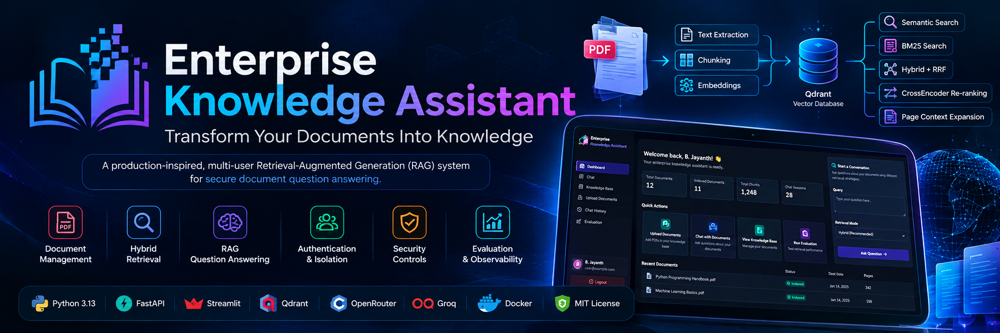
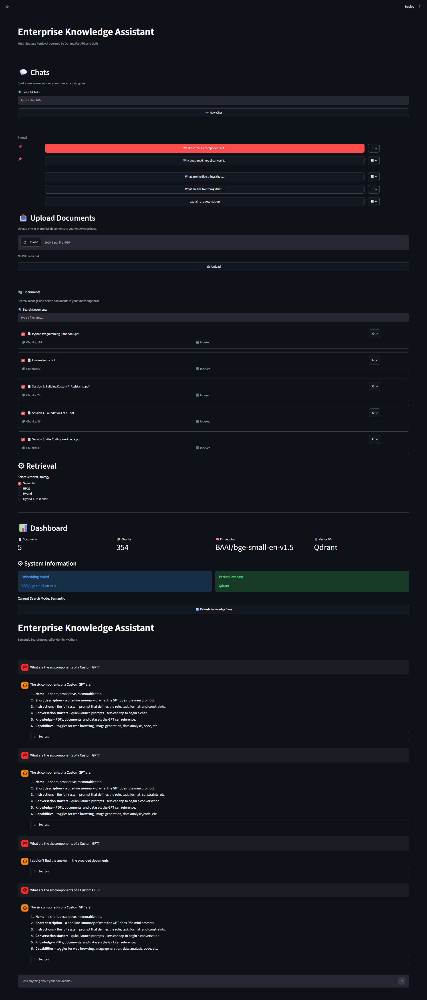
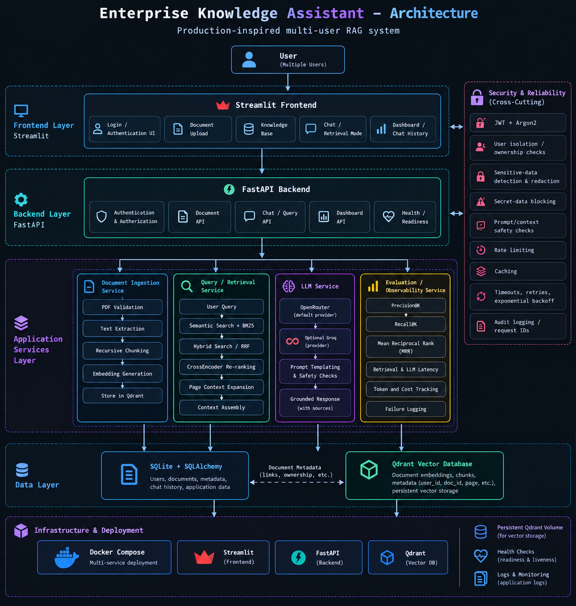
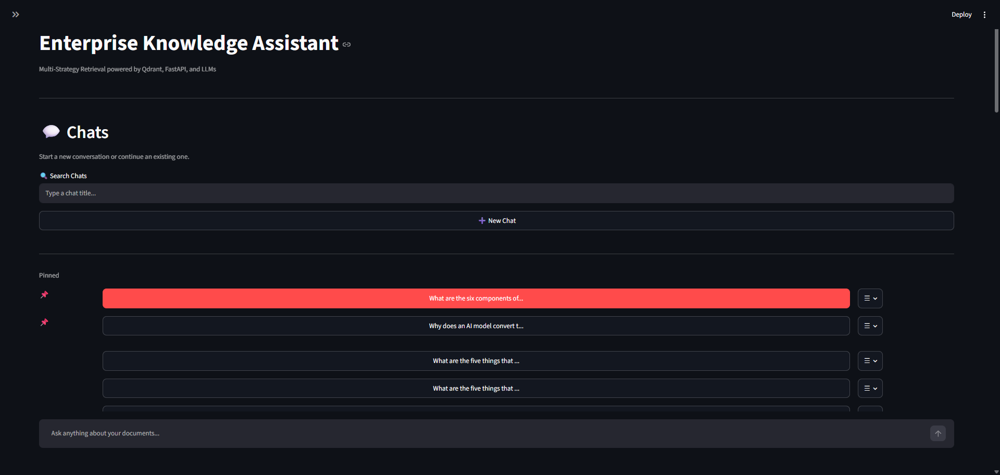
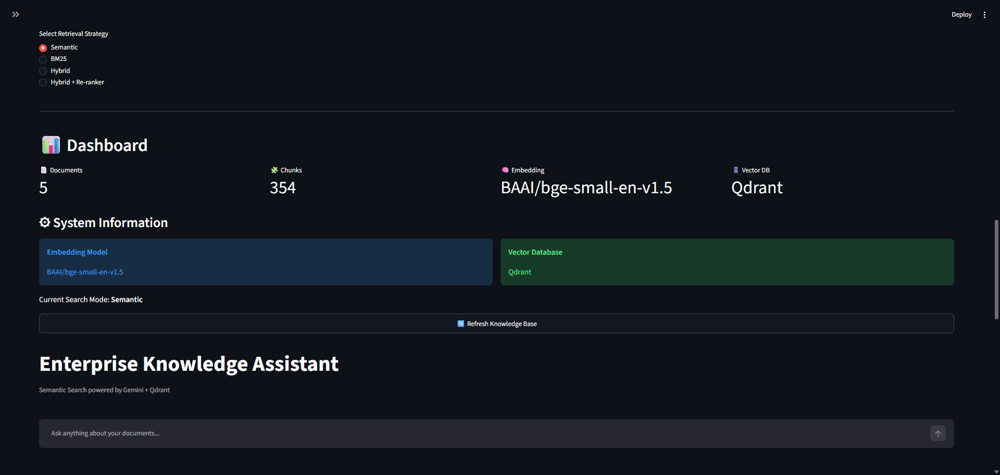
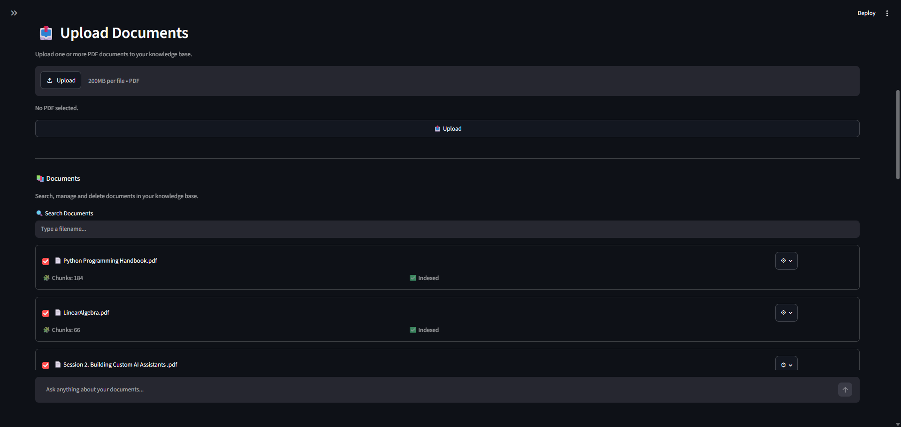
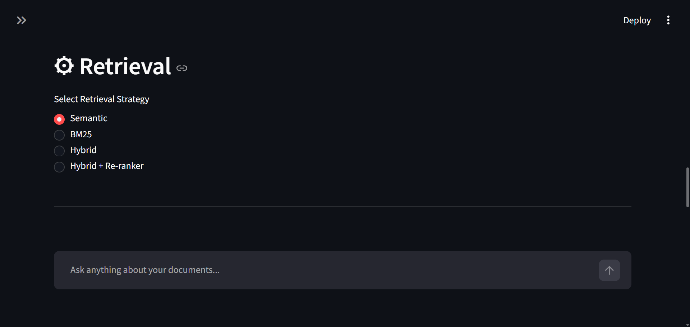
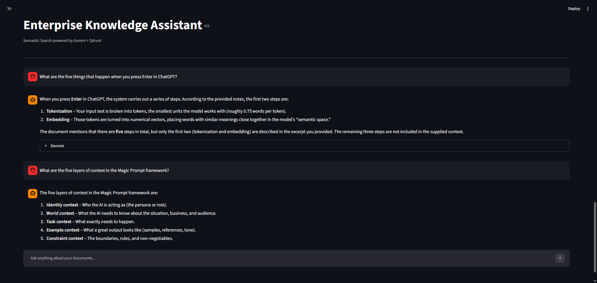

# 🚀 Enterprise Knowledge Assistant

<p *align*="center">

</p>

<p align="center">
  <strong>A production-inspired, multi-user Retrieval-Augmented Generation (RAG) system for secure document question answering.</strong>
</p>

<p align="center">
  Built with FastAPI, Streamlit, Qdrant, hybrid retrieval, BM25, Reciprocal Rank Fusion, CrossEncoder re-ranking, and configurable LLM providers.
</p>

<p align="center">


</p>

---

## 🖥️ Application Preview



---

## 📌 Overview

**Enterprise Knowledge Assistant** is a production-inspired Retrieval-Augmented Generation (RAG) application designed for question answering over user-uploaded PDF documents.

Instead of relying only on an LLM's parametric knowledge, the system retrieves relevant information from an isolated document knowledge base and provides that context to the language model before generating an answer.

The retrieval layer supports multiple strategies:

- Semantic vector search
- BM25 keyword retrieval
- Hybrid retrieval
- Reciprocal Rank Fusion (RRF)
- CrossEncoder re-ranking
- Page-level context expansion

The application is built around a **FastAPI backend**, **Streamlit frontend**, and **Qdrant vector database**, with additional controls for authentication, user isolation, rate limiting, observability, caching, background ingestion, and failure handling.

The goal of the project is not simply to demonstrate a basic RAG pipeline, but to explore the engineering considerations involved in building a more reliable and production-oriented document QA system.

---

# ⭐ Key Features

### 📄 Document Management

- Upload one or multiple PDF documents
- Automatic document ingestion and indexing
- Background PDF processing
- Document processing status tracking
- Duplicate document detection using file hashing
- Search and manage documents
- Download uploaded documents
- Delete documents
- Persistent vector storage using Qdrant

### 🔍 Multi-Strategy Retrieval

- Dense semantic vector search
- BM25 keyword retrieval
- Hybrid retrieval
- Reciprocal Rank Fusion (RRF)
- CrossEncoder re-ranking
- Configurable retrieval strategies
- Page-level context expansion for multi-chunk answers

### 🤖 Grounded Question Answering

- Context-aware document QA
- Source-grounded responses
- Configurable LLM providers
- OpenRouter integration
- Optional Groq provider
- Context and prompt safety checks
- Controlled LLM failure handling

### 👤 Authentication & Isolation

- JWT-based authentication
- Secure password hashing using Argon2
- User-level document ownership
- User-isolated retrieval
- Ownership validation for document operations

### 🛡️ Security Controls

- Authentication and authorization
- User data isolation
- Sensitive-data detection
- Confidential-data redaction
- Secret-data blocking
- Prompt/context injection checks
- Controlled model egress
- Safe error handling
- Security audit events

### ⚙️ Reliability & Performance

- Background document ingestion
- Query response caching
- Request timeouts
- Controlled retries
- Exponential backoff
- Structured error handling
- Health and readiness checks
- Endpoint-specific API rate limiting

### 📊 Evaluation & Observability

- Retrieval benchmark dataset
- Precision@K
- Recall@K
- Reciprocal Rank
- Mean Reciprocal Rank (MRR)
- Retrieval latency tracking
- LLM latency tracking
- Token and cost tracking
- Structured failure logging
- Request tracing
- Retrieval evaluation across multiple strategies

---

# 🏗️ System Architecture



The system is organized into separate frontend, API, retrieval, service, evaluation, and infrastructure layers.

---

### High-Level Flow

```text
                    ┌──────────────────────┐
                    │      Streamlit       │
                    │      Frontend        │
                    └──────────┬───────────┘
                               │
                               ▼
                    ┌──────────────────────┐
                    │       FastAPI        │
                    │       Backend        │
                    └──────────┬───────────┘
                               │
                ┌──────────────┼──────────────┐
                │              │              │
                ▼              ▼              ▼
        ┌──────────────┐ ┌────────────┐ ┌──────────────┐
        │Authentication│ │ Documents  │ │ Query        │
        │& Security    │ │& Ingestion │ │ Service      │
        └──────────────┘ └─────┬──────┘ └──────┬───────┘
                               │               │
                               ▼               ▼
                         ┌───────────┐   ┌───────────────┐
                         │  Qdrant   │   │   Retrieval   │
                         │ Vector DB │   │    Layer      │
                         └───────────┘   └───────┬───────┘
                                                │
                         ┌──────────────────────┼──────────────────────┐
                         │                      │                      │
                         ▼                      ▼                      ▼
                  Semantic Search          BM25 Search          Hybrid Search
                                                                  + RRF
                                                                        │
                                                                        ▼
                                                               CrossEncoder
                                                                Re-ranking
                                                                        │
                                                                        ▼
                                                            Page Context Expansion
                                                                        │
                                                                        ▼
                                                               Context Assembly
                                                                        │
                                                                        ▼
                                                               LLM Provider
                                                                        │
                                                                        ▼
                                                            Grounded Answer
                                                              + Sources
```

---

## 🔎 Retrieval Pipeline

The retrieval system is designed as a configurable multi-strategy pipeline rather than depending on a single search method.

## 1. Document Processing

PDF documents are uploaded through the Streamlit interface and processed by the backend.

The ingestion pipeline extracts document content, creates chunks, generates embeddings, and stores the resulting representations in Qdrant.
```text
PDF
 ↓
Text Extraction
 ↓
Recursive Chunking
 ↓
Embeddings
 ↓
Qdrant
```
The current chunking configuration uses recursive splitting with a chunk size of approximately 1000 characters and 200 characters of overlap.

## 2. Semantic Retrieval

Semantic retrieval uses dense vector embeddings to identify chunks that are conceptually similar to the user's query.
```text
BAAI/bge-small-en-v1.5
```
This approach is useful when the query and document use different wording but express similar concepts.

## 3. BM25 Retrieval

BM25 provides keyword-based retrieval.
This is particularly useful when a query contains:

- Exact terminology
- Technical names
- Specific phrases
- Keywords that may not be strongly represented by semantic similarity

## 4. Hybrid Retrieval

Hybrid retrieval combines semantic and BM25 candidates.
The system uses Reciprocal Rank Fusion (RRF) to combine rankings from the different retrieval strategies.
```text
Semantic Search ─────┐
                     ├──► Reciprocal Rank Fusion ──► Candidate Set
BM25 Search ─────────┘
```
This provides a balance between semantic relevance and exact keyword matching.

## 5. CrossEncoder Re-ranking

The retrieved candidate set can then be passed through a CrossEncoder to obtain a more precise relevance ordering.
```text
Initial Retrieval
       ↓
Candidate Documents
       ↓
CrossEncoder
       ↓
Re-ranked Documents
```
The current reranking model is:
```text
cross-encoder/ms-marco-MiniLM-L-6-v2
```
The CrossEncoder is used as a ranking model rather than treating its raw score as a probability.

## 6. Page-Level Context Expansion

During evaluation, a retrieval failure mode was identified where an answer could span multiple chunks from the same document page.

For example:
```text
Retrieved Chunk
      ↓
Relevant information found
      ↓
Other chunks on same page
      ↓
Expanded context
      ↓
LLM
```
To improve context completeness, the final retrieval stage expands selected results with additional chunks from the same document page while preserving user/document ownership boundaries.

This helps the generation layer receive the complete local context required for multi-chunk answers.

---

## 📊 Retrieval Evaluation
Retrieval quality was evaluated using a benchmark dataset containing representative questions over the Python Programming Handbook.

The evaluation compares four retrieval configurations:

- Semantic Search
- BM25
- Hybrid Search
- Hybrid Search + CrossEncoder

Metrics:

- Precision@5
- Recall@5
- Mean Reciprocal Rank (MRR)

Benchmark Results

| Retrieval Strategy | Precision@5 | Recall@5 | MRR |
|---|---:|---:|---:|
| Semantic | 0.20 | 0.75 | 0.617 |
| BM25 | 0.24 | **0.85** | 0.383 |
| Hybrid | 0.20 | 0.75 | **0.750** |
| Hybrid + CrossEncoder | **0.22** | 0.80 | 0.642 |

Observations

The evaluation demonstrates that the retrieval strategies have different strengths:

- BM25 achieved the highest Recall@5 (0.85) in the benchmark.
- Hybrid retrieval achieved the highest MRR (0.75).
- Hybrid + CrossEncoder provided a balanced retrieval configuration, with 0.80 Recall@5 and 0.642 MRR.
- Semantic retrieval provided useful conceptual matching but was not always sufficient for exact multi-page or keyword-heavy questions.

The benchmark also exposed retrieval failure cases, which were used to identify and address multi-chunk context completeness issues.

```text
The reported numbers are from the project's current benchmark dataset and should be interpreted as evaluation evidence for this implementation rather than a universal accuracy claim.
```

---

# 🧪 Failure-Aware Evaluation

The evaluation framework is not limited to a single aggregate score.

The system records retrieval results and helps identify cases where:

- Relevant pages are not retrieved
- Only part of a multi-chunk answer is retrieved
- Keyword retrieval outperforms semantic retrieval
- Ranking differs between retrieval strategies
- Re-ranking changes candidate ordering

This makes evaluation part of the development workflow rather than an afterthought.

```text
Benchmark Query
      ↓
Retrieval Strategy
      ↓
Top-K Results
      ↓
Relevant Page Comparison
      ↓
Precision / Recall / MRR
      ↓
Failure Analysis
      ↓
Retrieval Improvements
```

---

## 🔐 Security & Privacy

The application includes multiple controls intended to make the system safer for multi-user document workflows.

Authentication

- JWT-based authentication
- Argon2 password hashing
- Authenticated API access

User Isolation

Documents and retrieval operations are scoped to the authenticated user.

This prevents one user's indexed documents from being returned during another user's retrieval request.

Data Protection

The application includes controls for:
- Sensitive-data detection
- Confidential-data redaction
- Secret-data blocking
- Controlled model egress

Prompt / Context Protection

The query pipeline includes checks intended to reduce the risk of malicious instructions embedded within retrieved document context.

Auditability

Security-relevant events are recorded through structured audit logging.

---

## ⚙️ Reliability & Observability

The system includes several mechanisms beyond the core RAG pipeline.

Background Ingestion
PDF ingestion runs as a background process so that document uploads do not require the frontend to wait for the entire indexing process synchronously.

Document status is tracked throughout the ingestion lifecycle.

Error Handling
The backend uses:

- Structured errors
- Safe error responses
- LLM failure handling
- Request timeouts
- Controlled retries
- Exponential backoff

Rate Limiting

API endpoints use endpoint-specific rate limits to reduce abuse and uncontrolled request volume.

Caching

Frequently repeated queries can use response caching to reduce unnecessary LLM and retrieval work.

Health Checks

The backend provides health/readiness endpoints for deployment and operational checks.

Metrics

The system tracks operational information including:
- Request latency
- Retrieval latency
- LLM latency
- Token usage
- Estimated cost
- Failure events
- Policy decisions
- Request IDs

---

## 🖥️ Application Screenshots

## Dashboard



The dashboard provides an overview of the user's document knowledge base and application activity.

---

## Knowledge Base



Users can manage uploaded documents and monitor document processing status.

---

## Document Upload



The application supports uploading multiple PDF documents and tracking their indexing status.

---

## Chat Interface



Users can ask questions against their document knowledge base and select the retrieval strategy used for the query.

---

## Chat Response



Responses are generated using retrieved document context and include source references.

---

## 🛠️ Technology Stack

| Category | Technology |
|---|---|
| Language | Python 3.13 |
| Backend | FastAPI |
| Frontend | Streamlit |
| Vector Database | Qdrant |
| Database | SQLite + SQLAlchemy |
| Embeddings | BAAI/bge-small-en-v1.5 |
| Keyword Retrieval | BM25 |
| Hybrid Retrieval | Semantic + BM25 |
| Rank Fusion | Reciprocal Rank Fusion |
| Re-ranking | CrossEncoder |
| LLM Gateway | OpenRouter |
| Optional LLM Provider | Groq |
| Authentication | JWT |
| Password Hashing | Argon2 |
| Configuration | Pydantic Settings |
| Containerization | Docker / Docker Compose |
| Evaluation | Precision@K, Recall@K, MRR |

---

## 📂 Project Structure

```text
enterprise-rag-assistant/
│
├── app/
│   ├── api/
│   ├── chunking/
│   ├── config/
│   ├── embeddings/
│   ├── evaluation/
│   ├── llm/
│   ├── loaders/
│   ├── prompts/
│   ├── retrieval/
│   ├── schemas/
│   ├── services/
│   ├── utils/
│   └── vectorstore/
│
├── frontend/
│   ├── components/
│   ├── state/
│   ├── storage/
│   ├── backend_client.py
│   └── ui.py
│
├── scripts/
│
├── assets/
├── data/
├── tests/
│
├── docker-compose.yml
├── Dockerfile
├── requirements.txt
├── requirements.docker.txt
├── main.py
└── README.md
```

---

## ⚙️ Local Installation

1. Clone the Repository

```text
git clone https://github.com/boddetijayanth22/Enterprise-Knowledge-Assistant.git

cd Enterprise-Knowledge-Assistant
```

2. Create a Virtual Environment

```text
python -m venv .venv
```

Windows

```text
.venv\Scripts\activate
```

Linux / macOS

```text
source .venv/bin/activate
```

3. Install Dependencies

```text
pip install -r requirements.txt
```

4. Configure Environment Variables
Create a .env file from the provided example:

```text
cp .env.example .env
```
Configure the required application settings and LLM provider credentials.

The application supports configurable LLM providers through the project's provider configuration.

---

## ▶️ Running Locally

Start the Backend

```text
uvicorn main:app --reload
```

The FastAPI backend runs on:

```text
http://localhost:8000
```

Start the Frontend
In a separate terminal:

```text
streamlit run frontend/ui.py
```

The Streamlit application will be available through the URL displayed by Streamlit.

---

## 🐳 Docker Deployment
The project includes Docker-based deployment for the application services.

Start the complete stack with:

```text
docker compose up --build
```
The deployment includes:

```text
Streamlit
    │
    ▼
FastAPI
    │
    ├── SQLite
    │
    └── Qdrant
```
Qdrant uses persistent storage through the configured Docker volume.

To stop the stack:

```text
docker compose down
```

---

## 🚀 Usage

1. Start the application.
2. Authenticate with your account.
3. Upload one or more PDF documents.
4. Wait for document indexing to complete.
5. Open the chat interface.
6. Select the desired retrieval strategy.
7. Ask a question about the uploaded documents.
8. Review the generated answer and source references.
9. Use the dashboard and knowledge base to manage documents and sessions.

## 🔬 Evaluation

The retrieval benchmark can be executed using the project's evaluation script.

Example:
```text
python -m scripts.evaluate_retrieval \
  --owner-id 3 \
  --document "Python Programming Handbook.pdf" \
  --k 5
```

Available retrieval modes include:
```text
semantic
bm25
hybrid
hybrid_reranker
```
The evaluation framework calculates retrieval metrics against the benchmark dataset and provides results for comparing retrieval strategies.

---

## 🧩 API Architecture

The backend is implemented using FastAPI and follows a modular service-oriented structure.

Major responsibilities include:
```text
API Layer
   ↓
Authentication
   ↓
Service Layer
   ↓
Retrieval / Ingestion / LLM Services
   ↓
Persistence / Vector Database
```

The backend provides functionality for:

- Authentication
- Document upload
- Document management
- Document status
- Retrieval
- Question answering
- Dashboard metrics
- Health/readiness checks

The production configuration also controls API documentation exposure based on the deployment environment.

---

# 🔭 Future Directions

The current repository represents the **frozen V2 Enterprise Knowledge Assistant**.

Potential future directions include:

- Agentic workflows
- MCP-based tool integration
- Automated workflows
- Advanced document modalities
- More advanced retrieval evaluation
- Tool-using AI assistants
- Multi-step reasoning workflows

These capabilities are intentionally outside the current V2 scope.

---

# ⚠️ Known Limitations

This project is **production-inspired rather than a fully managed production SaaS platform**.

Current limitations include:

- SQLite is used for application-level relational persistence.
- Qdrant is deployed as part of the application environment rather than as a managed vector service.
- Retrieval benchmark coverage is limited to the current evaluation dataset.
- Retrieval quality varies by query type and document structure.
- Some questions requiring information across multiple pages may still require further retrieval research.
- The current system primarily targets PDF-based knowledge bases.

The benchmark results should therefore be interpreted within the scope of the current dataset and application.

---

# 🎯 Engineering Goals

The project focuses on several practical RAG engineering problems:

```text
                    ┌──────────────────────┐
                    │  Reliable Retrieval  │
                    └──────────┬───────────┘
                               │
        ┌──────────────────────┼──────────────────────┐
        ▼                      ▼                      ▼
  Search Quality          Context Quality       Evaluation
        │                      │                      │
        ▼                      ▼                      ▼
 Semantic + BM25        Page Context          Precision
 Hybrid + RRF           Expansion             Recall
 CrossEncoder                                 MRR
        │                      │                      │
        └──────────────────────┼──────────────────────┘
                               ▼
                     Grounded Generation
                               │
                               ▼
                   Secure Document Assistant
```
The emphasis is on measuring retrieval behavior, identifying failure modes, and engineering around those failures rather than treating an LLM call as the entire RAG system.

---

## 📜 License

This project is licensed under the MIT License.

---

## 👨‍💻 Author

**B. Jayanth**

B.Tech — Computer Science & Engineering (AI/ML)

Interested in:

- Artificial Intelligence
- Generative AI
- Retrieval-Augmented Generation
- AI Agents
- LLM Applications

---

<p align="center">
  ⭐ If you found this project useful, consider giving the repository a star.
</p>
